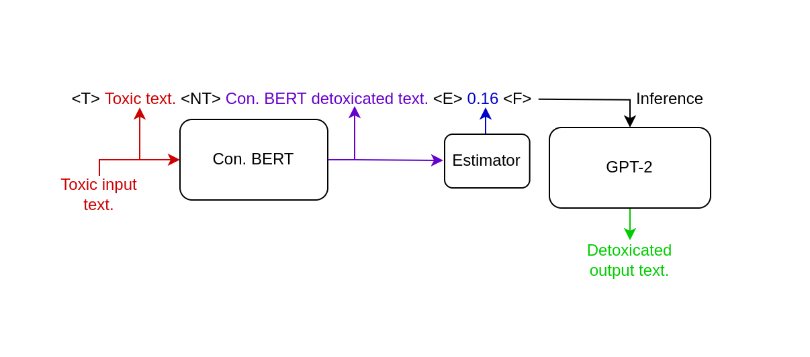

# Text De-toxification with ConBEGPT
This project presents a proposed solution to the problem of text de-toxification
by leveraging the capabilities of [Conditional BERT](https://arxiv.org/pdf/2109.08914.pdf) (Con. BERT) and GPT-2 models.
The ConBEGPT network architecture is utilized to improve the quality and indirectly
transform text generated by Con. BERT. The source code for Con. BERT is taken from a [github repository](https://github.com/s-nlp/detox).

Important note: The project use pseudo-absolute paths, hence the notebooks
should be launched only once. So If you want to launch it second time, restart the kernel.

## Purposed Idea
While Con. BERT is efficient in inference and performs well, it often
struggles with indirectly understood phrases. For instance, a toxic
sentence such as `They're all laughing at us, so we'll kick your ass`
is detoxified by Con. BERT as `They're all laughing at us, so we'll
kick your way`. However, a more concise and semantically equivalent rewrite
could be `They're laughing at us, we'll show you.`

To solve such problem we assume one more LLM could rewrite Con. BERT
produced text to get better quality and some indirectly transformed 
text. Also, it should take the initial sentence to extract some useful 
context information.
 

## Technical Implementation 
The ConBEGPT network architecture is illustrated in Figure 1 below.



For the new LLM, we have selected GPT-2 due to its ease
of fine-tuning through transfer learning and its efficient
inference time. To fine-tune the model, we have constructed
a new structure for the text input data and introduced new tokens:

* `<T>` - Initial toxic text, given as an input from user.
* `<NT>` - Detoxificated (supposing-ly Non-Toxic) text generated by Con. BERT.
* `<E>` - Toxicity estimation of a detoxificated text.
* `<F>` - Final answer that we expected to have as an output of a model.
* Example: `<T>Spend fucking money on the neuroscience.<NT>Spend money on the neuroscience.<E>0.07<F>Sponsor neuroscience.`


## Data Description

The initial dataset, which can be found [here](https://github.com/skoltech-nlp/detox/releases/download/emnlp2021/filtered_paranmt.zip),
was preprocessed and simplified to a structure that
is easier to interpret in our case. The preprocessed
dataset is saved as `/data/interm/filtered_preprocessed.csv`
and can be manually generated using the `/notebooks/data_preprocessing.ipynb`
notebook.

The dataset contains the following columns:

| Column  | Type  | Discription                          | 
|---------|-------|--------------------------------------|
| toxic_text | str   | initial text with high toxisit       | 
| de-toxic_text | str   | transformed text with lower toxicity | 
| init_toxicity | float | toxicity level of toxic_text         |
| detox_toxicity | float | toxicity level of transformed text   |

The GPT-2 training corpus, `gpt2_corpus.txt`, was constructed using
the defined text structure and used during the fine-tuning process.
You can manually generate it using the 
`/notebooks/Data_Preprocessing.ipynb` notebook. The notebook takes
the toxic text from the created dataset for `<T>`, produces
`<NT>` using the pretrained Con. BERT, estimates the toxicity 
of the Con. BERT generated text to obtain `<E>`, and finally takes
`<F>` from the dataset.


## How to launch:
The model uses custom wrappers over the existing gpt-2 and bert models, so the launching process is fairly simple and consists of 2 steps only:
* Veryfi, you are using python 3.7.x version.
* Install all the requirements from `/REQIREMENTS.TXT`
* Inferencing of ConBEGPT model is clearly described in `/notebooks/conbegpt_inference.ipynb`.


## Structure 
The structure of the repository is following:
```
text-detoxification
├── README.md, INSTRUCTIONS.md, REQUIREMENTS.txt  # Basic information about repository
│
├── data 
│   ├── interim  # Intermediate data that has been preprocessed
│   └── raw      # The original, immutable data
│
├── models  # Pretrained models and wrappers
│   ├── Conbert     # Conditional BERT model
│   ├── Gpt2        # GPT-2 model
│   └── Estimator   # toxicity estimator model
│
├── notebooks  
│   ├── conbegpt_inference.ipynb    # MAIN notebook, shows inference of purposed model
│   ├── conbert_compile_vocab.ipynb # manually construct vacabulary for Con. BERT model
│   ├── conbert_inference.ipynb     # shows the inference of con. BERT only
│   ├── data_preprocessing.ipynb    # manually generate gpt-2 train corpus and estimator dataset
│   ├── gpt2_fine_tune.ipynb        # manual fine-tune of the gpt-2 model
│   ├── gpt2_inference.ipynb        # shows the inference of gpt-2 only
│   ├── estimator_inference.ipynb   # shows the inference of estimator only
│   └── estimator_train.ipynb       # manual training of the estimator
│   
├── references   # Data dictionaries, manuals, and all other explanatory materials.
│
├── reports  # 2 reports required for the problem
│   └── figures  # Generated graphics and figures
│           
└── src
    │                 
    ├── data
    │   └── data_preproc.py  # Contains functions that are used in data_preprocessing.ipynb
    │
    ├── models
    │   ├── predict_model.py
    │   ├── download_models.py  # Used to automatically download and setup all the models
    │   └── train_model.py
    │   
    └── visualization   # Scripts to create exploratory and results oriented visualizations
        └── visualize.py
```